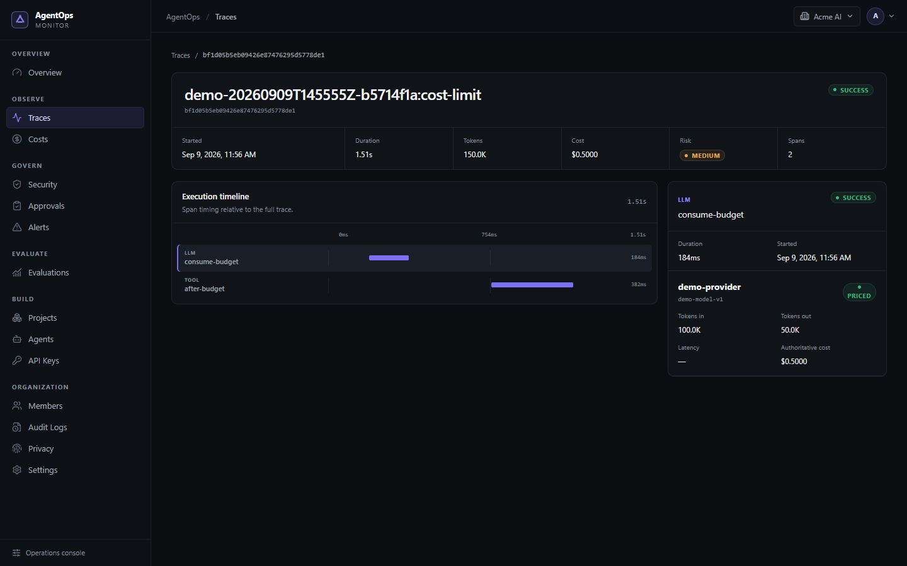
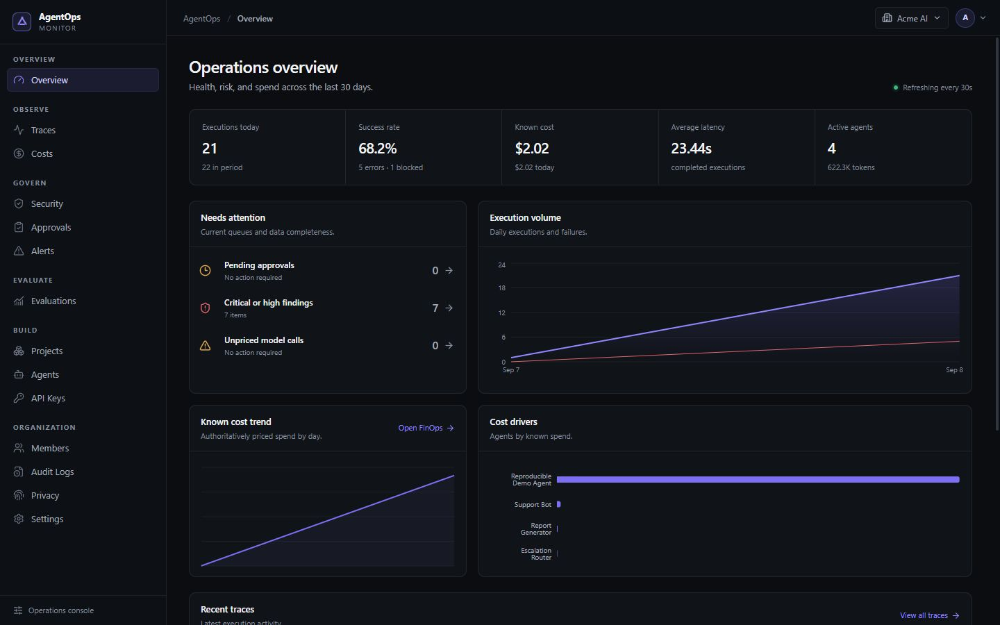
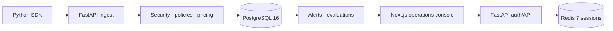
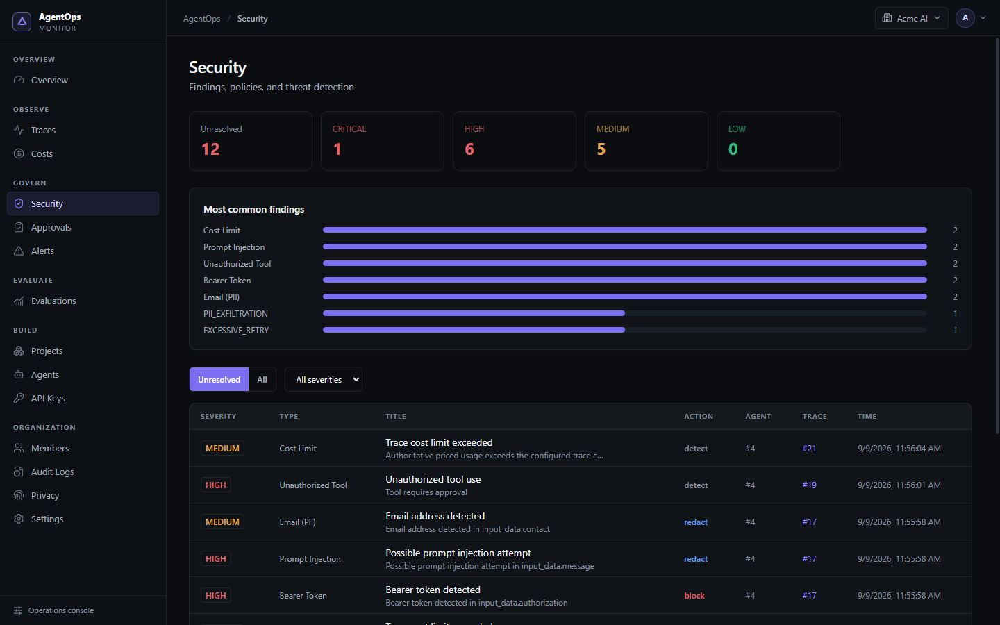
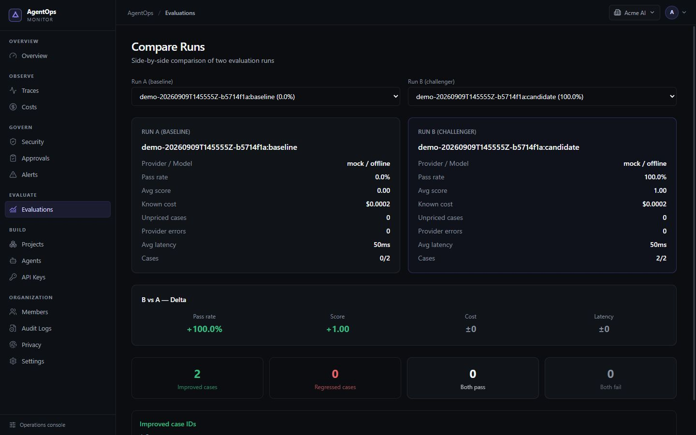

# AgentOps Monitor

**Open-source observability, security, governance, FinOps, and evaluations for AI agents.**

Trace what agents do, understand what they cost, enforce what they may do, and review what requires a human.

[](https://github.com/esportellini/agentops-monitor/actions/workflows/ci.yml)


[](LICENSE)
[](https://github.com/esportellini/agentops-monitor/releases/latest)



## What it is

AgentOps Monitor is a self-hosted control plane for teams operating AI agents. A Python SDK records hierarchical execution data while the backend applies security scanning, policy preflight, authoritative pricing, human approvals, runtime alerts, and evaluations. The Next.js console connects those signals for investigation and day-to-day operations.

## Key capabilities

| Capability | Status |
|---|---|
| Hierarchical traces, spans, tool calls, and model calls | Implemented |
| Automatic sensitive-data detection and redaction | Implemented |
| Authoritative, versioned model pricing | Implemented |
| Runtime tool, domain, capture, security, and budget policies | Implemented |
| Single-use human tool approvals | Implemented |
| Scoped alert rules and incident lifecycle | Implemented |
| Offline and optional OpenAI Responses evaluations | Implemented |
| Deterministic end-to-end Docker demo | Implemented |

## Run the demo

Requirements: Python 3.12, Docker, Docker Compose, and free ports 3000, 8000, 5432, and 6379.

```bash
python scripts/demo.py --reset
```

The command builds the complete stack, configures it through real management APIs, generates linked traces, and verifies security, policies, approvals, pricing, alerts, evaluations, and dashboard APIs. It must finish with **10/10 deterministic scenarios passing** and leaves the console at [http://localhost:3000](http://localhost:3000).

Demo credentials are local and fictitious:

| User | Password | Role |
|---|---|---|
| `owner@demo.agentops.dev` | `demo-owner-2024` | Owner |
| `analyst@demo.agentops.dev` | `demo-analyst-2024` | Analyst |

> **Local demo only. Never use these credentials outside the demo stack.**

Run `python scripts/demo.py` again without reset to verify idempotent bootstrap. The default demo never calls an external model. See [the demo guide](docs/DEMO.md) for optional flags and scenario details.



## Architecture



Ingest uses project-scoped API keys. Management APIs use short-lived JWT access tokens with refresh-token state in Redis. Every domain resource is scoped to an organization, and cross-organization access is rejected and audited.

## Feature walkthrough

### Observe and account for execution

The trace explorer reconstructs span hierarchy, tool and model calls, status, latency, tokens, risk, and cost. Pricing is resolved server-side by provider, model, organization, and effective date. Calls without a matching rate remain visible as `UNPRICED`; they are never presented as free.

### Govern risky actions

Agent policies run before tools execute. They can allow or block tools and domains, require a human approval, disable payload capture, choose security actions, and enforce trace token or known-cost limits. Approved attempts are revalidated and consumed once.



### Evaluate quality and trade-offs

Datasets run against a deterministic offline mock provider or the optional OpenAI Responses provider. External-provider execution requires explicit consent and a server-side `OPENAI_API_KEY`. Results combine deterministic evaluators, latency, provider errors, human review, and authoritative cost; run comparison highlights improved, regressed, and unchanged cases.



## Python SDK quickstart

Install the SDK from this checkout:

```bash
python -m pip install -e ./sdk-python
```

```python
from agentops_monitor import AgentOps

client = AgentOps(
    api_key="agom_your_local_key",
    endpoint="http://localhost:8000",
    policy_fail_mode="closed",
)

with client.trace("answer-request") as trace:
    trace.set_input({"question": "What requires review?"})
    with trace.span("retrieve-context", span_type="RETRIEVAL") as span:
        span.set_output({"documents": 3})
    trace.set_output({"status": "complete"})

client.flush()
```

See [the Python SDK guide](docs/PYTHON_SDK.md) for resilience, tool preflight, approvals, privacy controls, and model-call instrumentation.

## Tech stack

- Python 3.12, FastAPI, SQLAlchemy async, Alembic
- PostgreSQL 16 and Redis 7
- Next.js 15.5 LTS, React 19, TypeScript, Tailwind CSS, TanStack Query, Recharts
- Docker and Docker Compose

## Security and privacy

Payloads are scanned before persistence. Supported findings include PII, credentials, API keys, bearer tokens, prompt injection, and dangerous SQL patterns. Configured actions can detect, redact, alert, or block; evidence stores safe metadata rather than the original secret. Retention, anonymization, subject requests, RBAC, and immutable audit records are built in.

Production deployments must replace all local secrets, terminate TLS, restrict CORS, protect storage and backups, and provide infrastructure-level encryption. Report vulnerabilities through [the security policy](SECURITY.md), without including secrets in public issues.

## Development and tests

Manual development setup:

```bash
cp .env.example .env
docker compose up --build
```

Local release checks:

```bash
# Backend
cd backend && pytest app/tests/ -v

# SDK
cd sdk-python && python -m pip install -e ".[dev]" && pytest tests/ -v

# Demo unit tests
pytest tests/test_demo.py tests/test_release_version.py -v

# Frontend
cd frontend && npm ci && npm run lint && npm run type-check && npm run build
```

GitHub Actions repeats these checks, dependency audits, package build, and the real Docker demo.

## Documentation

- [Architecture](docs/ARCHITECTURE.md)
- [Reproducible demo](docs/DEMO.md)
- [Product design system](docs/DESIGN.md)
- [Security model](docs/SECURITY.md)
- [Evaluations](docs/EVALUATIONS.md)
- [Python SDK](docs/PYTHON_SDK.md)
- [LGPD and privacy](docs/LGPD_AND_PRIVACY.md)
- [Roadmap](docs/ROADMAP.md)
- [Changelog](CHANGELOG.md)
- [Contributing](CONTRIBUTING.md)

## Limitations and roadmap

External Slack/email delivery, distributed background evaluation execution, SSO, OpenTelemetry ingestion, advanced anomaly detection, and production orchestration beyond Docker Compose are outside v0.2. The current alert workflow is in-app, and evaluation providers execute sequentially within the request.

## License

[MIT](LICENSE) © 2026 Enzo Sportellini.
